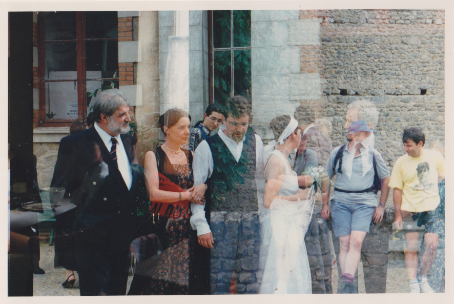

# image_decomposition

## Description

This project explores the decomposition of superimposed images using deep learning techniques. It is an extension the image processing lecture taken at ENSEEIHT. The main goal of this project is to decompose the following image target.png. This photography is an undesired double exposure of two different scenes.



The data used in this project comes from the PISC (People in Social Context) dataset which contains images of peoples in different scenes. Many research papers inspired this work such as the ones mentionned in [references](#references). A full report of my work, written in french, can be found in [superimposed_image_decomposition.pdf](superimposed_image_decomposition.pdf).

## Installation

```
pip install -r requirements.txt
pip install 'tensorflow[and-cuda]'
```

## References

[1] Junnan Li, Yongkang Wong, Qi Zhao, and Mohan S. Kankanhalli.  
**Dual-Glance Model for Deciphering Social Relationships.**  
*arXiv preprint arXiv:1708.00634*, 2017.  
Accepted at IEEE International Conference on Computer Vision (ICCV), 2017.  
[https://arxiv.org/abs/1708.00634](https://arxiv.org/abs/1708.00634)  
DOI: [10.48550/arXiv.1708.00634](https://doi.org/10.48550/arXiv.1708.00634)

---

[2] Cyrian Ragot.  
**Image Decomposition.**  
GitHub repository, 2025. Accessed: 2025-06-08.  
[https://github.com/cyrianR/image-decomposition](https://github.com/cyrianR/image-decomposition)

---

[3] Phillip Isola, Jun-Yan Zhu, Tinghui Zhou, and Alexei A. Efros.  
**Image-to-Image Translation with Conditional Adversarial Networks.**  
*arXiv preprint arXiv:1611.07004*, 2017.  
Presented at CVPR 2017.  
[https://arxiv.org/abs/1611.07004](https://arxiv.org/abs/1611.07004)  
DOI: [10.48550/arXiv.1611.07004](https://doi.org/10.48550/arXiv.1611.07004)

---

[4] Jun-Yan Zhu, Taesung Park, Phillip Isola, and Alexei A. Efros.  
**Unpaired Image-to-Image Translation using Cycle-Consistent Adversarial Networks.**  
*arXiv preprint arXiv:1703.10593*, 2017.  
Extended version of the ICCV 2017 paper.  
[https://arxiv.org/abs/1703.10593](https://arxiv.org/abs/1703.10593)  
DOI: [10.48550/arXiv.1703.10593](https://doi.org/10.48550/arXiv.1703.10593)

---

[5] Zhengxia Zou, Sen Lei, Tianyang Shi, Zhenwei Shi, and Jieping Ye.  
**Deep Adversarial Decomposition: A Unified Framework for Separating Superimposed Images.**  
*Proceedings of the IEEE/CVF Conference on Computer Vision and Pattern Recognition*, 2020, pp. 12806–12816.

---

[6] Yossi Gandelsman, Assaf Shocher, and Michal Irani.  
**"Double-DIP": Unsupervised Image Decomposition via Coupled Deep-Image-Priors.**  
*The IEEE Conference on Computer Vision and Pattern Recognition (CVPR)*, June 2019.

